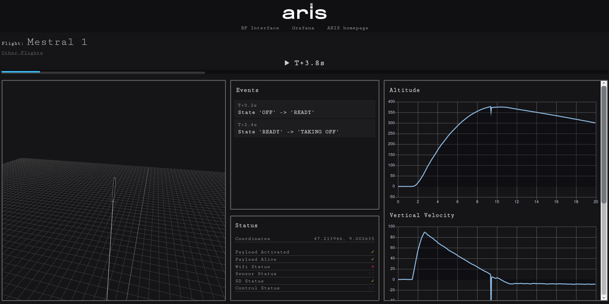

# ARIS Groundstation

Visualization/data handling/storage solutions for ARIS.

This is in development so don't count on things staying where they are, stuff might move around quite a lot in here.

## Usage
First make sure, docker and docker-compose are installed. Check the [official Docker website](https://docs.docker.com/install/) for that.

```bash
git clone https://github.com/Pascal-So/aris-groundstation.git
cd aris-groundstation

# Grafana tends to complain if this directory isn't set up with the correct permissions.
mkdir container-data/grafana && sudo chown -R 472 container-data/grafana

# This step might take a while..
sudo docker-compose build
```

Start the docker containers on the groundstation laptop with `sudo docker-compose up`. Some data (e.g. flight data) will be stored in the directory container-data.

The flight data is received from the usb device specified in the `docker-compose.yml` file and stored in an InfluxDB Database with the name `flight-Y-m-d-H-M-S`.

## Todo

## Troubleshooting

### General
Look at the output of `docker-compose up`, where some info will be printed by the various containers while running.

If Pascal told you something should be working, but it appears to not be working, make sure you've got the newest version with `git pull` before asking.

If you ran `git pull`, but nothing changes, remember to run `docker-compose build` to rebuild the docker images.

### Containers
If a container is not running, check if the block in `docker-compose.yml` is commented out.

### xbee module
If you can't connect to the module, check if the baud rate in `rfInterface/xbee.py` and the usb device in `docker-compose.yml` are correct. On most systems, you can check the usb port the module is connected to with `ls /dev/ttyUSB*`.

If your module gets rejected, add the 64bit address to the `known_modules` list in `rfInterface/rf_interface.py`.

If XCTU can't find the module, sometimes you have to connect the usb cable and start XCTU before plugging in the power to the module...

### Streaming data to Server
You need to be connected to the vpn network.

### InfluxDB
InfluxDB tends to spam the output if it was killed rather than shut down properly, last time the docker-compose service was running. If this happens, just shut use `docker-compose down` and `docker-compose up` again. `docker-compose restart` doesn't seem to fix it..

If InfluxDB is installed on your local machine and the docker container can't start, run this command:
```
sudo systemctl stop influxdb.service
```


## Containers

### influx
Runs InfluxDB on port 8086. This port is exposed by docker-compose, so if you have influxdb installed on the host machine, you can get a cli to it by typing `influx` in your terminal.

### receiver
Python script that receives data from the xbee module. Adjust the name of the device in `docker-compose.yml` to match the usb port to which the module is connected. This script then sends the data to InfluxDB. It also hosts a server on port 5000, over which a command can be entered and sent over the xbee via broadcast.

Received flight data gets stored, in addition to InfluxDB, to some text files in the directory `/var/log/receiver`. Make sure a docker volume is mounted to that directory, in order to preserve the logs.

### grafana
Default grafana instance, use this to inspect the data in InfluxDB directly. A connection and dashboard needs to be set up on first use, but then the config will be stored in the `container-data` directory and will be available even after the container has been destroyed.

### data-provider
NodeJS server accepting requests for flight data on port 8080, fetching that data from InfluxDB, and returning it to the browser.

### visualization
VueJS app visualizing the flight data with ThreeJS and ChartJS. The app can be run standalone with `npm run dev` in the `visualization` directory (port 8081). To run the app with docker-compose, the image has to be rebuilt after every code change, which takes a while. The compiled app is then served with Apache.


